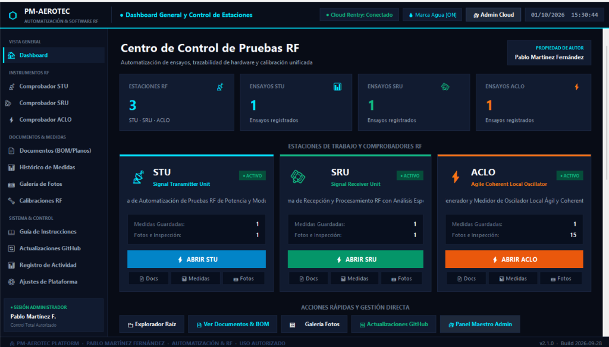

# PM-AEROTEC Platform — Centro Oficial de Distribución y Descargas

Bienvenido al repositorio oficial de **PM-AEROTEC Platform** — Plataforma Unificada de Automatización de Ensayos y Control de Estaciones de Radiofrecuencia (STU, SRU, ACLO).

Desarrollado y administrado por **Pablo Martínez Fernández**.

---

## 🚀 Descarga Oficial (Paquete Completo Instalable)

| Versión | Descripción | Tamaño | Enlace de Descarga |
| :--- | :--- | :--- | :--- |
| **v2.1.0** | Suite Oficial con Plataforma PM-AEROTEC, STU, SRU y ACLO (Sin código fuente) | ~284 MB | [Descargar PM_AEROTEC_COMPANEROS_DISTRIB.zip](https://github.com/pablomtecnologia/INDRARISE-Distribucion/releases) |

---

## 📋 Módulos Integrados

- **📡 STU (Signal Transmitter Unit):** Sistema de comprobación y automatización de unidades transmisoras.
- **🛰️ SRU (Signal Receiver Unit):** Sistema de recepción, procesamiento y análisis espectral.
- **⚡ ACLO (Agile Coherent Local Oscillator):** Medición y control de osciladores locales ágiles y coherentes.

---

## 🛠️ Instrucciones de Instalación y Uso:

1. **Descargar:** Obtén el archivo comprimido **`PM_AEROTEC_COMPANEROS_DISTRIB.zip`** desde la sección [Releases](https://github.com/pablomtecnologia/INDRARISE-Distribucion/releases).
2. **Descomprimir:** Extrae el contenido del archivo ZIP en cualquier ubicación o pendrive USB.
3. **Ejecutar:** Haz doble clic en el ejecutable principal **`PM_AEROTEC.exe`** para iniciar el centro de control.
4. **Operación:** Desde el Dashboard interactivo podrás iniciar las estaciones STU, SRU y ACLO, consultar planos/BOM, historial de medidas y calibraciones.

---
© Pablo Martínez Fernández — *Todos los derechos reservados.*
